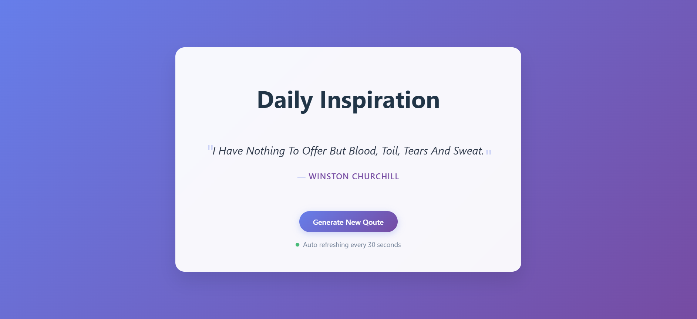

# Inspiration Flow: Your Daily Dose of Wisdom

## Introduction

Inspiration Flow is a minimalist, dynamic client-side web application designed to provide users with a continuous stream of motivation. Built with speed and simplicity in mind, the app fetches high-quality quotes from an external API and presents them in a distraction-free interface. Whether you need a quick boost to start your day or a consistent flow of wisdom while you work, Inspiration Flow automates the process by refreshing content every 30 seconds, ensuring your perspective remains fresh and inspired.

## Project Type

Frontend (Single Page Application)

## Deployed App

**Live Site:** [https://quote-generator-dwaraka.vercel.app/]

**API Source:** This project consumes data from the [DummyJSON Quotes API](https://dummyjson.com/docs/quotes), which provides a vast library of famous sayings and authors.

## Features

- **Instant Inspiration:** Fetches and displays a random, high-quality quote immediately upon page load.
- **Automated Refresh Cycle:** Features a built-in timer logic using `setInterval` that automatically updates the quote every 30 seconds, acting as a "live" ambient display.
- **Manual Control:** A dedicated "Generate New Quote" button allows users to bypass the timer and fetch a new insight instantly.
- **Robust Loading States:** Includes a custom CSS-animated loading spinner and transition states to ensure a smooth user experience even on slower network connections.
- **Visual Feedback:** A dedicated "Auto-refresh indicator" with a pulsing animation lets users know the app is active and working in the background.
- **Clean Typography & Design:** Optimized for readability with a focus on elegant font scales and a center-aligned, modern aesthetic.
- **Full Responsiveness:** The UI adapts seamlessly from desktop monitors to mobile screens using flexible CSS layouts and media queries.

## Design Decisions or Assumptions

- **Hook-Based Logic:** I utilized the `useEffect` hook to manage the lifecycle of the API calls and the interval timer. I ensured a **cleanup function** (`clearInterval`) was implemented to prevent memory leaks and redundant timers when the component unmounts.
- **State Management:** For a focused app of this scale, I chose local React `useState` hooks over complex global stores (like Redux) to keep the bundle size small and performance high.
- **Asynchronous Data Fetching:** The app uses the modern `async/await` syntax for the Fetch API, providing readable and maintainable code for handling network requests and potential errors.
- **Styling Architecture:** I used a combination of `index.css` for global typography/resetting and a component-specific `QuoteGenerator.css` to keep the styling encapsulated and organized.
- **UX Focus:** The "Generate" button is disabled during the loading state to prevent redundant API calls and potential UI flickering.

## Usage

1.  Navigate to the deployed app URL.
2.  The first quote will load automatically.
3.  **To get a new quote immediately:** Click the "Generate New Quote" button.
4.  **Hands-free mode:** Simply leave the tab open; the app will update itself with a new piece of wisdom every 30 seconds.
5.  Check the bottom indicator to verify that the auto-refresh system is active.

## Technology Stack

- **Framework:** React 18+ (Vite)
- **Build Tool:** Vite
- **Styling:** CSS3 (Flexbox, Animations, Media Queries)
- **Data Fetching:** Fetch API
- **Language:** JavaScript (ES6+)
- **Deployment:** Vercel
